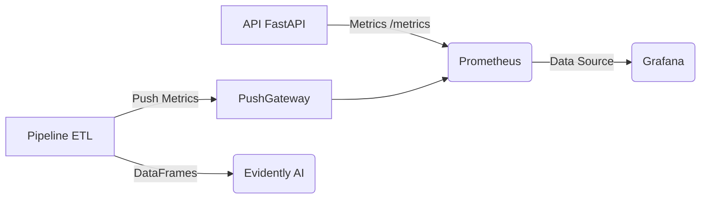

# 🔍 Documentation du Monitoring et de l'Observabilité

Ce projet intègre une stack complète de monitoring pour surveiller à la fois la santé technique de l'application (Backend/ETL) et la qualité des données métier (Data Drift).

---

## 🏗️ Architecture du Monitoring

Le système repose sur trois piliers principaux :

1.  **Prometheus** (Port `9090`) : Base de données temporelle qui collecte les métriques.
2.  **Grafana** (Port `3000`) : Interface de visualisation (Dashboards) connectée à Prometheus.
3.  **Evidently AI** (Port `8101`) : Outil spécialisé dans la surveillance de la qualité des données (ML/Data Monitoring).

---

## 1. Prometheus (Collecte des Métriques)

Prometheus est le cœur du système. Il "scrape" (récupère) les données périodiquement depuis les services configurés.

*   **URL** : [http://localhost:9090](http://localhost:9090)
*   **Fichier de config** : `prometheus.yml`

### 📊 Métriques Surveillées

Nous surveillons deux types de métriques :

#### A. Métriques Techniques (Infrastructure & API)
Ces métriques sont exposées automatiquement par l'API FastAPI (`/metrics`).
*   `http_requests_total` : Nombre total de requêtes HTTP reçues.
*   `http_request_duration_seconds` : Latence des réponses.
*   `db_connection_status` : État de la connexion à la base de données (1 = OK, 0 = KO).

#### B. Métriques Métier (ETL & Qualité Air)
Ces métriques sont définies sur mesure dans `src/monitoring/metrics.py` et poussées via la **Pushgateway**.
*   `etl_last_run_success_timestamp` : Heure de la dernière exécution réussie de l'ETL.
*   `etl_error_count_total` : Compteur d'erreurs par source (WAQI, ARIA, CDTN...).
*   `etl_processed_rows_total` : Volume de données traitées (utile pour voir si une source ne renvoie plus rien).
*   `air_quality_index_value` : Dernière valeur de l'indice AQI enregistrée par ville.

### 🕵️ Comment vérifier ?
1.  Allez sur [http://localhost:9090/targets](http://localhost:9090/targets) pour vérifier que l'API et la Pushgateway sont bien "UP".
2.  Allez sur [http://localhost:9090/graph](http://localhost:9090/graph) et tapez `etl_error_count_total` pour voir les erreurs brutes.

---

## 2. Grafana (Visualisation)

Grafana permet de créer des tableaux de bord visuels à partir des données de Prometheus.

*   **URL** : [http://localhost:3000](http://localhost:3000)
*   **Identifiants par défaut** : `admin` / `admin`

### 🚀 Guide Rapide
1.  **Connexion** : Connectez-vous avec les identifiants ci-dessus.
2.  **Data Source** : Une source de données "Prometheus" doit être configurée (URL: `http://prometheus:9090`).
3.  **Dashboards** : Vous pouvez créer des panneaux pour visualiser :
    *   *Taux d'erreur API* (Graphique des codes 500).
    *   *Fraîcheur des données* (Jauge basée sur `etl_last_run_success_timestamp`).
    *   *Qualité de l'air* (Carte ou tableau basé sur `air_quality_index_value`).

---

## 3. Evidently AI (Qualité des Données & Data Drift)

Evidently est différent de Prometheus. Il ne regarde pas si le serveur "répond", mais si les **données** ont changé de nature (Data Drift). C'est crucial pour l'IA et les statistiques.

*   **URL** : [http://localhost:8101](http://localhost:8101)
*   **Scripts** : `src/data_monitoring/`

### 🧠 C'est quoi le "Data Drift" ?
Le Data Drift se produit quand les données actuelles ne ressemblent plus aux données historiques (ex: la répartition des types d'accidents change radicalement, ou les capteurs de qualité de l'air commencent à envoyer des valeurs aberrantes).

### 🛠️ Fonctionnement
1.  Le Scheduler exécute périodiquement des scripts de monitoring (`src/data_monitoring/drift/aria_drift.py`).
2.  Le script compare :
    *   **Reference Data** : Les 50% de données les plus anciennes (ce qu'on considère "normal").
    *   **Current Data** : Les 50% de données les plus récentes.
3.  Il génère un rapport complet (HTML/JSON) et l'envoie au serveur Evidently.

### 📈 Comment lire les résultats ?
1.  Allez sur l'interface Evidently ([http://localhost:8101](http://localhost:8101)).
2.  Ouvrez le projet **"ARIA Monitoring"** ou **"WAQI Monitoring"**.
3.  Cliquez sur le dernier rapport généré.
4.  **Quoi regarder ?**
    *   **Dataset Drift** : Si "Detected", cela signifie que globalement, les données ont changé.
    *   **Column Drift** : Regardez quelles colonnes spécifiques ont dérivé.
        *   *Exemple* : Si la colonne "Ville" est en drift, peut-être qu'une nouvelle ville a été ajoutée massivement dans les données, ce qui peut biaiser les statistiques historiques.

---

## 🔄 Résumé des Flux

| Composant | Rôle | Port | URL | Quoi surveiller ? |
| :--- | :--- | :--- | :--- | :--- |
| **Prometheus** | Collecteur | 9090 | [Lien](http://localhost:9090) | Targets UP/DOWN |
| **Grafana** | Visualiseur | 3000 | [Lien](http://localhost:3000) | Graphiques d'erreurs, Latence |
| **Evidently** | Qualité Data | 8101 | [Lien](http://localhost:8101) | Data Drift (Rouge = Alerte) |
