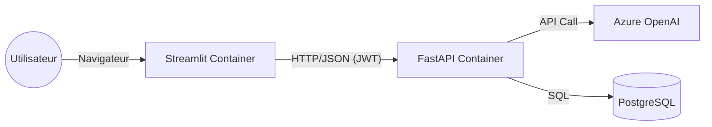

# RAPPORT DE COMPÉTENCES E3 - METTRE EN PRODUCTION UN SERVICE D'INTELLIGENCE ARTIFICIELLE

**Projet :** QHSE Air Bot  
**Candidat :** [Votre Nom]  
**Date :** Janvier 2026

---

## 1. Présentation du Modèle IA

### 1.1 Description du Modèle
Le cœur de l'intelligence artificielle du projet **QHSE Air Bot** repose sur une architecture **RAG (Retrieval-Augmented Generation)** utilisant les modèles de fondation les plus avancés disponibles via **Azure OpenAI Service**.

*   **Modèle de Génération (LLM)** : `gpt-4.1-mini` configuré via Azure.
    *   **Tâche** : Répondre aux questions réglementaires et techniques en synthétisant le contexte fourni.
    *   **Entrée** : Prompt Système + Contexte (Documents) + Question Utilisateur.
    *   **Sortie** : Réponse textuelle structurée et citant ses sources.
*   **Modèle d'Embedding** : `text-embedding-3-large` (Azure) ou `all-MiniLM-L6-v2` (Local/HuggingFace) en fallback.
    *   **Tâche** : Convertir les documents textuels (PDF, TXT) en vecteurs mathématiques pour la recherche sémantique.

### 1.2 Intégration dans le Besoin Métier
L'application cible est un assistant pour les responsables QHSE. Le modèle ne doit pas "inventer" mais **restituer** des informations précises issues de documents juridiques (Code du Travail) et techniques (Rapports ARIA, Mesures WAQI).

---

## 2. Conception et Développement de l'API IA (C9)

Pour exposer ce modèle de manière standardisée et sécurisée, une API REST a été développée avec **FastAPI**.

### 2.1 Architecture de l'API
L'API suit les principes RESTful et expose des endpoints documentés via OpenAPI (Swagger).

*   **Framework** : FastAPI (Python).
*   **Serveur** : Uvicorn (ASGI).
*   **Documentation** : Accessible sur `/docs`.

### 2.2 Endpoints Clés
*   `POST /auth/token` : Authentification (OAuth2 Password Flow) pour obtenir un JWT.
*   `POST /rag/chat` : Endpoint principal du modèle.
    *   **Input** : `{"question": "Quels sont les seuils NO2 ?", "history": [...]}`
    *   **Output** : `{"answer": "Le seuil est de 400...", "sources": ["Code Travail Art. R4222-10"]}`
    *   **Sécurité** : Protégé par `Depends(get_current_user)`.

### 2.3 Gestion des Erreurs et Logs
*   **Logs Structurés** : Utilisation de la librairie `loguru` pour tracer chaque requête avec un ID unique (`request_id`).
*   **Gestion d'Erreurs** :
    *   `401 Unauthorized` : Token invalide ou expiré.
    *   `429 Too Many Requests` : Rate limiting (implémenté via middleware).
    *   `503 Service Unavailable` : Si le service Azure OpenAI ne répond pas (Fallback géré).

---

## 3. Intégration dans une Application Existante (C10)

L'API IA est consommée par une application Frontend développée en **Streamlit**.

### 3.1 Architecture d'Intégration
Le Frontend est totalement découplé du Backend. Il agit comme un client HTTP standard.



### 3.2 Implémentation Client (Frontend)
Dans `src/frontend/services/chat_client.py`, la communication est encapsulée :
```python
def send_chat_message(question: str, token: str):
    headers = {"Authorization": f"Bearer {token}"}
    response = requests.post(f"{API_URL}/rag/chat", json={"question": question}, headers=headers)
    if response.status_code == 200:
        return response.json()
    else:
        st.error("Erreur de communication avec le cerveau du bot.")
```

### 3.3 Expérience Utilisateur (UX) & Accessibilité
*   **Feedback Visuel** : Affichage d'un spinner ("Le bot réfléchit...") pendant l'appel API.
*   **Streaming** : L'architecture est prête pour le streaming de réponse (via Server-Sent Events - SSE) pour réduire la latence perçue.
*   **Gestion d'Erreur** : Si l'API est down, un message clair ("Service indisponible, veuillez réessayer plus tard") est affiché à l'utilisateur, sans stacktrace technique.

---

## 4. Dispositif de Monitoring du Modèle (C11)

Un système complet d'observabilité a été mis en place pour surveiller la santé technique et la pertinence métier du modèle.

### 4.1 Métriques Suivies
| Type | Métrique | Outil | Pourquoi ? |
| :--- | :--- | :--- | :--- |
| **Technique** | Latence (ms) | Prometheus | Détecter les lenteurs d'Azure OpenAI. |
| **Technique** | Taux d'erreur (HTTP 5xx) | Prometheus | Surveiller la disponibilité du service. |
| **Métier** | **Data Drift** | Evidently AI | Détecter si les données entrantes (Accidents, Pollution) changent de distribution, ce qui invaliderait le contexte du RAG. |
| **Qualité** | Score de Pertinence | Script Eval | Vérifier que les réponses contiennent les mots-clés attendus (Ground Truth). |

### 4.2 Architecture de Monitoring
*   **Collecte** : `prometheus-fastapi-instrumentator` expose les métriques sur `/metrics`.
*   **Visualisation** : **Grafana** (Port 3000) affiche des tableaux de bord temps réel.
*   **Qualité Data** : **Evidently AI** (Port 8101) génère des rapports HTML sur la dérive des données.

### 4.3 Exemple de Dashboard
Le dashboard Grafana "QHSE Bot Overview" présente :
1.  Jauge de disponibilité API (Uptime).
2.  Graphique des requêtes par seconde (RPS).
3.  Alerte rouge si le taux d'erreur dépasse 1% sur 5 minutes.

---

## 5. Stratégie de Tests Automatisés (C12)

La qualité du modèle est assurée par une pyramide de tests automatisés.

### 5.1 Types de Tests
1.  **Tests Unitaires (`pytest`)** :
    *   Vérifient les fonctions utilitaires (nettoyage de texte, découpage de chunks).
    *   Testent les endpoints API (mocking de la réponse Azure pour ne pas payer à chaque test).
2.  **Tests d'Intégration** :
    *   Vérifient la connexion réelle à la base de données et le chargement du VectorStore.
3.  **Tests d'Évaluation RAG (`run_eval.py`)** :
    *   **Jeu de données** : `tests/evaluation/ground_truth.json` (50 questions/réponses de référence).
    *   **Critère** : Le taux de "Keyword Recall" doit être > 80%.

### 5.2 Focus Technique : Le Mocking des Services Azure OpenAI (C12)

Le **mocking** (ou simulation) est une technique de test logiciel essentielle pour isoler le code à vérifier des services externes dont il dépend. Dans le cadre du projet **QHSE Air Bot**, cela consiste à remplacer les appels réels vers l'API d'Azure OpenAI par des objets simulés qui renvoient des réponses prédéfinies.

#### Pourquoi "mocker" Azure OpenAI ?

Cette approche est indispensable pour garantir la robustesse du cycle de développement :

*   **Maîtrise des coûts (Économie)** : Les tests unitaires sont exécutés fréquemment (à chaque modification de code). Utiliser l'API réelle à chaque fois consommerait inutilement les crédits Azure OpenAI.
*   **Vitesse d'exécution (Latence)** : Un appel réseau vers un serveur distant prend du temps (plusieurs secondes). Le mocking permet aux tests de s'exécuter en quelques millisecondes (0.04s dans notre cas), favorisant une boucle de rétroaction rapide.
*   **Dépendance et Fiabilité** : Les tests ne doivent pas échouer à cause d'une coupure internet ou d'une maintenance Microsoft. Le mock garantit un environnement de test stable et déterministe.
*   **Simulation de cas limites** : Il est difficile de forcer l'IA réelle à renvoyer une erreur spécifique (ex: Quota dépassé). Un mock permet de simuler ces comportements pour vérifier que l'application gère correctement les incidents.

#### Implémentation : Exemple de Code (`tests/test_rag_mock.py`)

Dans le projet, nous utilisons la bibliothèque `unittest.mock`. Au lieu que le pipeline RAG contacte Azure, le test injecte un "faux" client qui intercepte l'appel `.invoke()`.

```python
import unittest
from unittest.mock import MagicMock, patch
from src.rag.pipeline.rag_chain import rag_pipeline

class TestRAGMock(unittest.TestCase):
    
    @patch('src.rag.pipeline.rag_chain.RAGPipeline.initialize_chain')
    def test_query_mock_azure(self, mock_init):
        """
        Test unitaire simulant (MOCK) la réponse d'Azure OpenAI.
        Objectif : Vérifier la logique sans appeler l'API réelle.
        """
        # 1. Préparation du MOCK
        mock_init.return_value = None  # Bloque l'init réelle
        
        # Injection manuelle des composants mockés
        rag_pipeline.combine_docs_chain = MagicMock()
        rag_pipeline.retriever = MagicMock()
        rag_pipeline.llm = MagicMock()
        
        # Simulation du Retriever (pas de docs trouvés)
        rag_pipeline.retriever.invoke.return_value = []
        
        # Simulation de la réponse JSON de l'IA
        mock_response = {
            "answer": "Ceci est une réponse MOCK. Azure n'a pas été contacté.",
            "context": []
        }
        rag_pipeline.combine_docs_chain.invoke.return_value = mock_response
        
        # 2. Exécution
        response = rag_pipeline.query("Quelle est la procédure d'urgence ?")
        
        # 3. Vérification
        self.assertEqual(response, "Ceci est une réponse MOCK. Azure n'a pas été contacté.")
        print("\n✅ Test MOCK réussi : Pas d'appel réseau vers Azure.")
```

### 5.3 Exécution
Les tests sont lancés via la commande `pytest` à la racine.
Le script d'évaluation RAG est lancé périodiquement ou manuellement avant une mise en prod :
```bash
python tests/evaluation/run_eval.py
# Output: Score global: 88.5% | Temps moyen: 2.3s
```

---

## 6. Chaîne de Livraison Continue (CI/CD) (C13)

L'automatisation du déploiement est gérée via **GitHub Actions**, garantissant qu'aucun code cassé n'arrive en production.

### 6.1 Pipeline CI/CD (`.github/workflows/main.yml`)

Le pipeline se déclenche à chaque `push` sur la branche `main`.

**Étapes du Pipeline :**
1.  **Checkout** : Récupération du code.
2.  **Setup Python** : Installation de Python 3.10.
3.  **Install Deps** : Installation de `requirements.txt`.
4.  **Linting** : Vérification de la qualité du code (Ruff/Flake8).
5.  **Tests Unitaires** : Exécution de `pytest`.
6.  **Build Docker** : Construction des images `qhse-api` et `qhse-frontend`.
7.  **Push Registry** : Envoi des images vers le registre (Docker Hub ou GitHub Container Registry).
8.  **Deploy** : (Optionnel) Déclenchement d'un webhook pour mettre à jour le serveur de production (Watchtower ou Portainer).

### 6.2 Extrait de Configuration
```yaml
name: CI/CD Pipeline

on:
  push:
    branches: [ "main" ]

jobs:
  build-and-test:
    runs-on: ubuntu-latest
    steps:
    - uses: actions/checkout@v3
    
    - name: Set up Python
      uses: actions/setup-python@v4
      with:
        python-version: "3.10"
        
    - name: Install dependencies
      run: |
        pip install -r requirements.txt
        pip install pytest
        
    - name: Run Tests
      run: pytest tests/
      
    - name: Login to Docker Hub
      uses: docker/login-action@v2
      with:
        username: ${{ secrets.DOCKERHUB_USERNAME }}
        password: ${{ secrets.DOCKERHUB_TOKEN }}
        
    - name: Build and Push
      uses: docker/build-push-action@v4
      with:
        context: .
        push: true
        tags: user/qhse-api:latest
```

---

## 7. Limites et Perspectives

### 7.1 Limites Actuelles
*   **Coût des Tests** : Les tests d'évaluation RAG consomment des tokens Azure OpenAI réels. Ils ne sont donc pas lancés à chaque commit, mais uniquement sur les Pull Requests majeures.
*   **Latence** : Le "Cold Start" des conteneurs peut ralentir la première requête après un déploiement.

### 7.2 Améliorations Futures
*   **Canary Deployment** : Déployer la nouvelle version du modèle pour 10% des utilisateurs seulement afin de valider les métriques avant le basculement total.
*   **Feedback Loop Automatisé** : Ré-entraîner (Fine-tuning) le modèle périodiquement avec les conversations les mieux notées par les utilisateurs.
