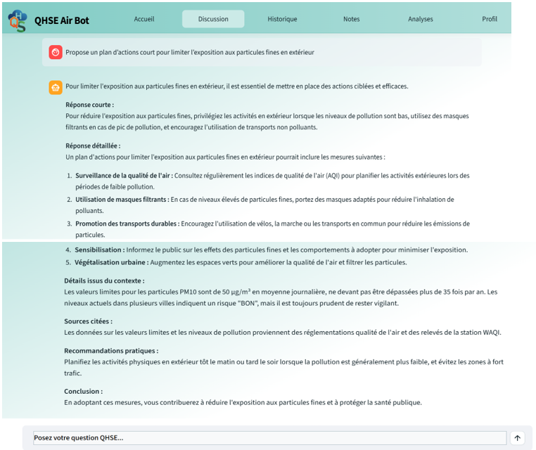
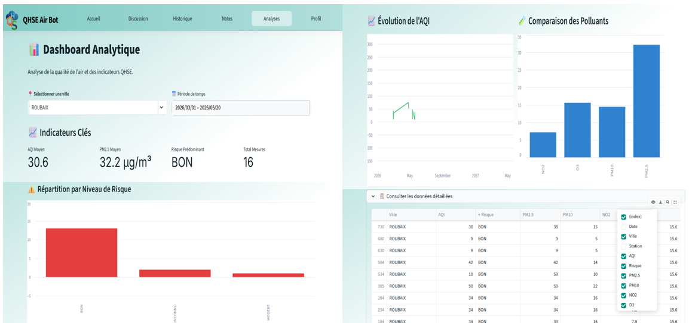
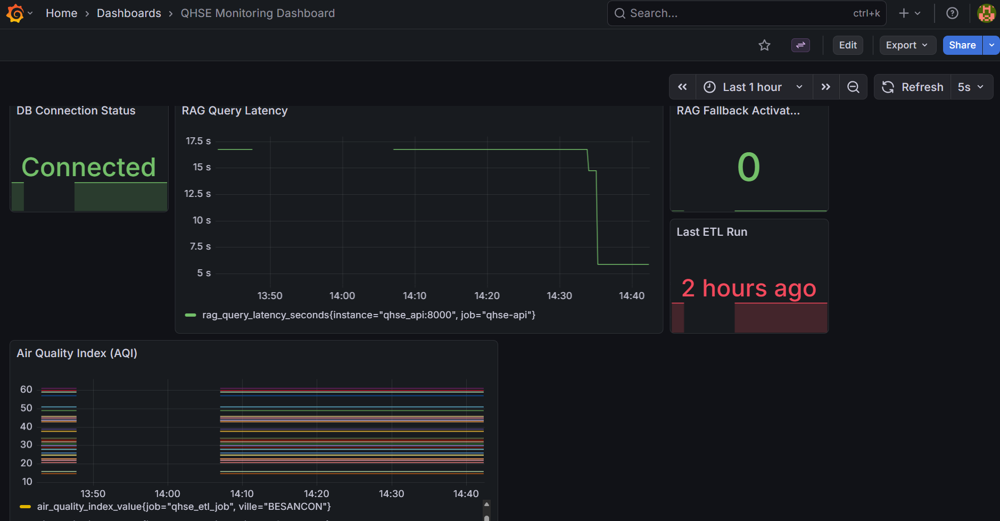

# QHSE Air Bot

### Plateforme d’analyse de données environnementales (ETL + IA + Dashboard)

---

## Description du projet

QHSE Air Bot est une plateforme d’analyse de données environnementales qui centralise, traite et exploite des données liées à la qualité de l’air et aux risques QHSE.
Le projet combine un pipeline ETL multi-sources, une API REST, un assistant IA basé sur RAG, un dashboard analytique et une stack de monitoring, dans une architecture locale reproductible via Docker.

---

## Architecture globale

- ETL (data ingestion) : collecte multi-sources (scraping + API + open data)
- API FastAPI : exposition des données et services applicatifs
- Assistant IA (RAG) : question-réponse sur données internes
- Dashboard Streamlit : visualisation et suivi des KPIs QHSE
- Monitoring : Prometheus / Grafana + qualité/dérive (Evidently)
- Exécution locale : Docker Compose (services isolés)

---

## Fonctionnalités principales

### Collecte et traitement des données (ETL)

- Scraping de données réglementaires : Code du Travail, INRS
- Données environnementales : qualité de l’air (WAQI)
- Retours d’expérience : incidents/accidents industriels (ARIA)
- Structuration, nettoyage et chargement en base PostgreSQL

### Assistant IA (RAG)

- Question-réponse basé sur les données internes collectées
- Modèles LLM : OpenAI, avec DeepSeek en fallback (si configuré)
- Recherche sémantique : embeddings + index FAISS
- Mode dégradé : embeddings locaux en cas d’indisponibilité API


### Dashboard analytique (Streamlit)

- Intégré dans la même application Streamlit (onglet Analyses)
- KPIs : AQI moyen, PM2.5 moyen, risque prédominant, nombre total de mesures
- Graphiques : évolution temporelle de l’AQI, comparaison des polluants (PM2.5, PM10, NO2, O3), répartition des risques
- Filtres : par ville et par période
- Objectif : support à la décision QHSE


### Monitoring & qualité

- Objectif : suivre l’état de la plateforme (ETL, API, base) et détecter rapidement les erreurs ou dérives de données.
- Suivi système et métriques : Prometheus
- Tableaux de bord : Grafana


- Qualité des données / drift : Evidently

- Logs structurés : Loguru

---

## API REST

API développée avec FastAPI :

- Endpoints documentés via Swagger
- Accès aux données issues de l’ETL
- Services applicatifs utilisés par l’application

---

## Stack technique

- Python 3.11
- FastAPI
- PostgreSQL
- Streamlit
- Docker / Docker Compose
- FAISS (vector search)
- LLM (OpenAI / DeepSeek)
- Prometheus / Grafana
- Evidently

---

## Installation et exécution

### 1) Lancer le projet

```bash
docker-compose up -d --build
```

### 2) Accès aux interfaces

| Service | URL |
| --- | --- |
| Frontend Streamlit | http://localhost:8501 |
| API Swagger | http://localhost:8100/docs |
| Grafana | http://localhost:3000 |
| Prometheus | http://localhost:9090 |
| Evidently UI | http://localhost:8101 |

### 3) Connexion (compte par défaut)

- Email : `admin@gmail.com`
- Mot de passe : `admin`

### 4) Lancer le pipeline ETL (si besoin)

```bash
docker exec qhse_scheduler python src/etl/pipeline.py
```

---

## Module IA (RAG)

### Ingestion des données

```bash
python src/rag/main.py --ingest
```

### Requête IA

```bash
python src/rag/main.py --query "Quelles sont les procédures en cas d'incendie ?"
```

---

## Sécurité et bonnes pratiques

- Gestion des secrets via `.env` (non versionné)
- Aucune clé API exposée dans le code
- Logs structurés, avec attention à la non-exposition de données sensibles
- Tests unitaires et d’intégration avec pytest

---

## Tests

```bash
pytest
```

---

## Objectif du projet

Projet reproduisant une architecture simplifiée de pipeline data industriel orienté QHSE.
