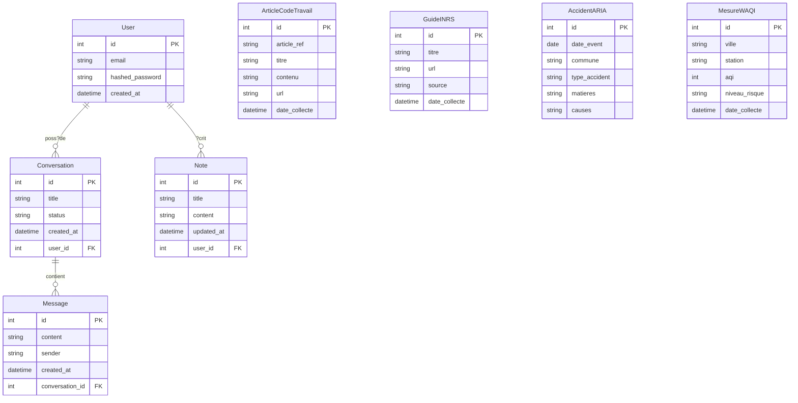
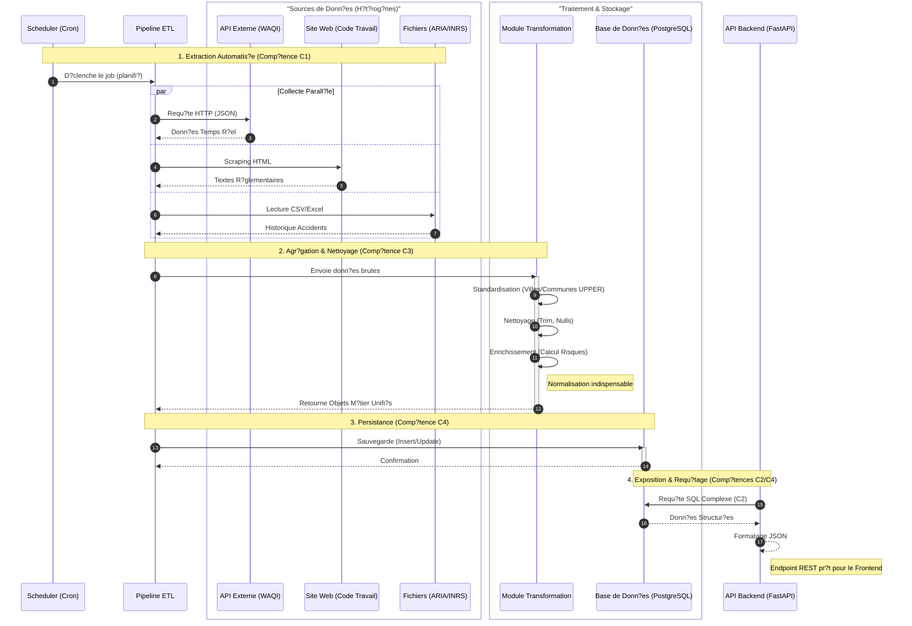

# Rapport Technique : Conception et D?veloppement d'une Solution IA

**Projet** : QHSE Air Bot (Assistant Intelligent Qualit? Hygi?ne S?curit? Environnement)  
**Bloc de Comp?tences** : n?1 - Conception et d?veloppement d?une solution d?intelligence artificielle

---

## 1. Contexte du Projet
Dans un environnement industriel de plus en plus contraint, les responsables QHSE (Qualit?, Hygi?ne, S?curit?, Environnement) font face ? une dispersion massive de l'information. Les donn?es critiques sont ?parpill?es entre capteurs IoT (qualit? de l'air), bases de donn?es gouvernementales (accidents industriels ARIA) et sources r?glementaires (Code du Travail, INRS). Cette fragmentation rend la veille r?glementaire et la pr?vention des risques fastidieuses et sujettes ? l'erreur humaine.

## 2. Probl?matique
**Comment centraliser et valoriser des donn?es h?t?rog?nes pour permettre une prise de d?cision proactive en mati?re de s?curit? environnementale ?**

Le d?fi technique r?side dans l'automatisation de la collecte de donn?es disparates (API, scraping, fichiers), leur normalisation pour permettre des croisements intelligents, et leur mise ? disposition s?curis?e.

## 3. Solution Apport?e
Le **QHSE Air Bot** est une plateforme int?gr?e qui :
1. **Automatise la collecte** (ETL) de donn?es environnementales et juridiques.
2. **Standardise l'information** pour permettre des analyses crois?es.
3. **Expose les r?sultats** via une API s?curis?e et un assistant conversationnel (RAG).

---

## Synth?se de la Validation des Comp?tences
Ce rapport d?taille la couverture des comp?tences **C1 ? C5** du r?f?rentiel Simplon "D?veloppeur IA". Chaque section explicite l'impl?mentation technique et fournit des **preuves de code** concr?tes pointant vers les fichiers du projet.

---

## C1 ? Automatiser l?extraction de donn?es

**Objectif** : Cr?er des scripts d'extraction automatis?s depuis des sources h?t?rog?nes (API, Web, Fichiers) avec une gestion robuste des erreurs et une ex?cution planifi?e.

### Impl?mentation
Le projet int?gre un pipeline ETL (Extract-Transform-Load) qui collecte des donn?es depuis 4 sources distinctes :
1. **WAQI (World Air Quality Index)** : API temps r?el.
2. **Code du Travail Num?rique** : scraping de la r?glementation.
3. **INRS** : scraping de guides de pr?vention.
4. **ARIA** : import de fichiers CSV/Excel d'accidents industriels.

L'automatisation est assur?e par un **Scheduler** int?gr? dans l'infrastructure Docker.

### Preuves de Code
* **Extraction API (WAQI)** :  
  [src/etl/collect.py](src/etl/collect.py) (m?thode `DataCollector.collect_waqi`).
* **Scraping Web (Code du Travail)** :  
  [src/etl/collect.py](src/etl/collect.py) (m?thode `DataCollector.collect_code_travail`).
* **Scraping Web (INRS)** :  
  [src/etl/collect.py](src/etl/collect.py) (m?thode `DataCollector.collect_inrs`).
* **Import Fichiers (ARIA)** :  
  [src/etl/collect.py](src/etl/collect.py) (m?thode `DataCollector.collect_aria`).
* **Orchestration du Pipeline** :  
  [src/etl/pipeline.py](src/etl/pipeline.py) (`run_pipeline()` orchestre Collect ? Transform ? Load ? Monitoring).
* **Planification Automatique (Scheduler)** :  
  [src/scheduler.py](src/scheduler.py) (planifie ETL ? 21:00 et ingestion RAG ? 22:00).  
  [docker-compose.yml](docker-compose.yml) (service `scheduler`).

---

## C2 ? Requ?tes complexes et manipulation de donn?es

**Objectif** : Interroger et manipuler les donn?es stock?es pour r?pondre aux besoins m?tier (statistiques, filtrage).

### Impl?mentation
Utilisation de SQL via SQLAlchemy pour des requ?tes analytiques. Une requ?te cl? du projet agr?ge les donn?es de qualit? de l'air (WAQI) par niveau de risque.

### Preuves de Code
* **API Endpoint (Impl?mentation Python)** :
  [src/api/endpoints.py](src/api/endpoints.py) (route `/stats/risks`) :
  ```python
  db.query(MesureWAQI.niveau_risque, func.count(MesureWAQI.id)).group_by(...)
  ```

* **Exemple de requ?te SQL (illustratif)** :
  *Le projet est con?u pour permettre des jointures inter-sources apr?s normalisation (voir C3). Exemple d?analyse possible :*
  ```sql
  SELECT 
      w.ville, 
      AVG(w.aqi) as qualite_air_moyenne, 
      COUNT(a.id) as nombre_accidents_industriels
  FROM mesures_waqi w
  JOIN accidents_aria a ON w.ville = a.commune
  GROUP BY w.ville
  HAVING AVG(w.aqi) > 50;
  ```

---

## C3 ? R?gles d?agr?gation et nettoyage

**Objectif** : Transformer les donn?es brutes en un format exploitable (nettoyage, standardisation, enrichissement).

### Impl?mentation
La classe `DataTransformer` assure la normalisation des donn?es avant insertion en base, notamment pour permettre des jointures futures entre sources h?t?rog?nes.
* **Nettoyage** : trim des cha?nes, gestion des valeurs nulles.
* **Standardisation** : conversion des villes/communes en **MAJUSCULES**.
* **Enrichissement** : calcul automatique du "niveau de risque" pour la qualit? de l'air.

### Preuves de Code
* **Normalisation pour Agr?gation (Villes/Communes en majuscules)** :
  [src/etl/transform.py](src/etl/transform.py) :
  ```python
  df['ville'] = df['ville'].astype(str).str.upper().str.strip()
  df['commune'] = df['commune'].astype(str).str.upper().str.strip()
  ```

* **Transformation WAQI (Enrichissement)** :  
  [src/etl/transform.py](src/etl/transform.py) (m?thode `transform_waqi`, fonction `get_risk_level`).

* **Qualit? des Donn?es (Monitoring)** :  
  [src/data_monitoring/](src/data_monitoring/) (scripts `quality` et `drift` utilisant Evidently AI).

---

## C4 ? Mettre ? disposition les donn?es

**Objectif** : Exposer les donn?es nettoy?es via une interface standardis?e (API) et assurer leur persistance.

### Impl?mentation
* **Persistance** : base de donn?es relationnelle PostgreSQL persistante via volume Docker.
* **Exposition** : API RESTful (FastAPI) avec documentation automatique (Swagger UI).
* **Standardisation** : sch?mas Pydantic pour garantir le format de sortie.

### Preuves de Code
* **Infrastructure de Stockage** :  
  [docker-compose.yml](docker-compose.yml) (service `postgres` et volume `postgres_data`).
* **Endpoints API (Mise ? disposition)** :  
  [src/api/endpoints.py](src/api/endpoints.py) (routes `/waqi/`, `/accidents/`, `/articles/`, `/guides/`).
* **Sch?mas de Sortie (Pydantic)** :  
  [src/api/models.py](src/api/models.py) (classes `WaqiRead`, `AccidentRead`, `ArticleRead`, `GuideRead`).
* **Consommation par le Frontend** :  
  [src/frontend/services/auth_client.py](src/frontend/services/auth_client.py) (appel ? `API_URL`).
  [docker-compose.yml](docker-compose.yml) (variable `API_URL` inject?e dans le service `frontend`).

---

## C5 ? Respecter les r?gles de conformit? et de s?curit?

**Objectif** : S?curiser l'acc?s aux donn?es (Authentification, Secrets) et assurer leur conformit? (Qualit?, Tra?abilit?, RGPD).

### Impl?mentation
* **Authentification Forte** : utilisation de JWT (JSON Web Tokens) pour s?curiser l'API.
* **Protection des Donn?es** : mots de passe hach?s (Bcrypt) avant stockage.
* **Gestion des Secrets** : variables d'environnement charg?es via Pydantic (fichier `.env` en local).
* **Tra?abilit?** : monitoring de la qualit? des donn?es (drift detection).

### Preuves de Code
* **S?curit? des Acc?s (Auth & Hashing)** :  
  [src/api/security.py](src/api/security.py) (fonctions `create_access_token`, `get_password_hash`).
  [src/api/auth.py](src/api/auth.py) (endpoints `/auth/login` et `/auth/register`).
  [src/api/conversations.py](src/api/conversations.py) (protection des routes via `Depends(get_current_user)`).
* **Gestion des Secrets** :  
  [src/config.py](src/config.py) (chargement des variables via `BaseSettings`).
* **Conformit? des Donn?es (Drift Detection)** :  
  [src/data_monitoring/drift/waqi_drift.py](src/data_monitoring/drift/waqi_drift.py).

---

## Annexe 1 : Mod?le Conceptuel de Donn?es (MCD)

Le diagramme suivant illustre la structure de la base de donn?es PostgreSQL, telle que d?finie dans [src/db/models.py](src/db/models.py). Il met en ?vidence les relations entre les utilisateurs, leurs interactions (conversations, notes) et les donn?es m?tier (WAQI, ARIA, r?glementation).



---

## Annexe 2 : Diagramme de S?quence - Pipeline de Donn?es (ETL & API)

Ce diagramme d?taille exclusivement le cycle de vie de la donn?e : de son extraction multi-sources jusqu'? sa mise ? disposition via l'API, en alignement direct avec les comp?tences du **Bloc 1**.


